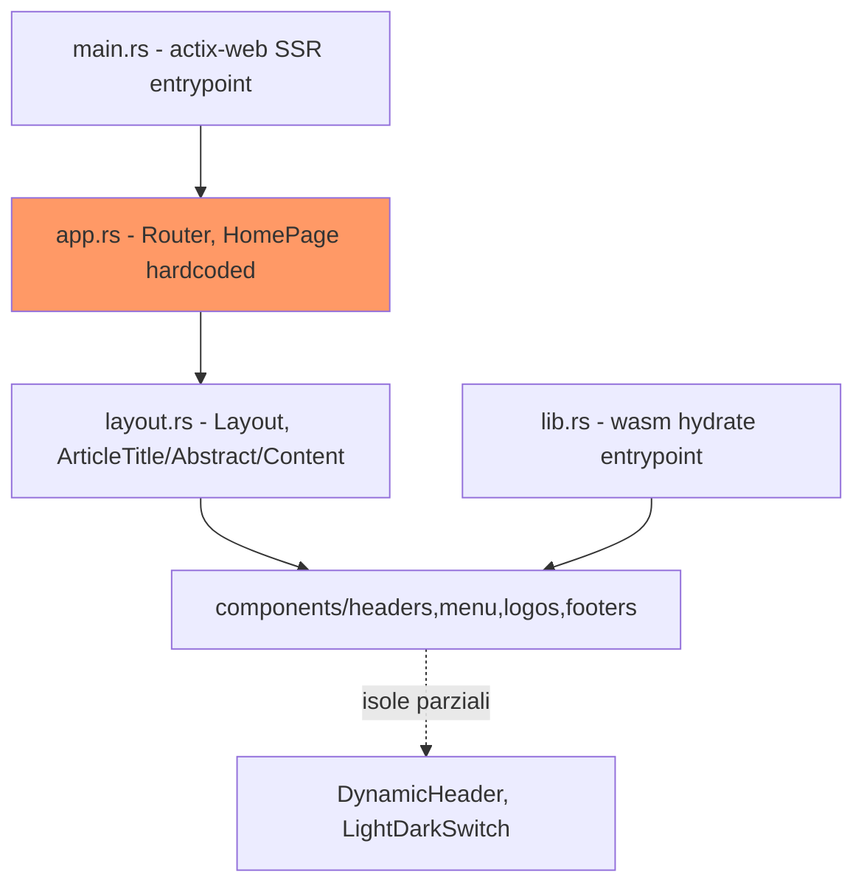
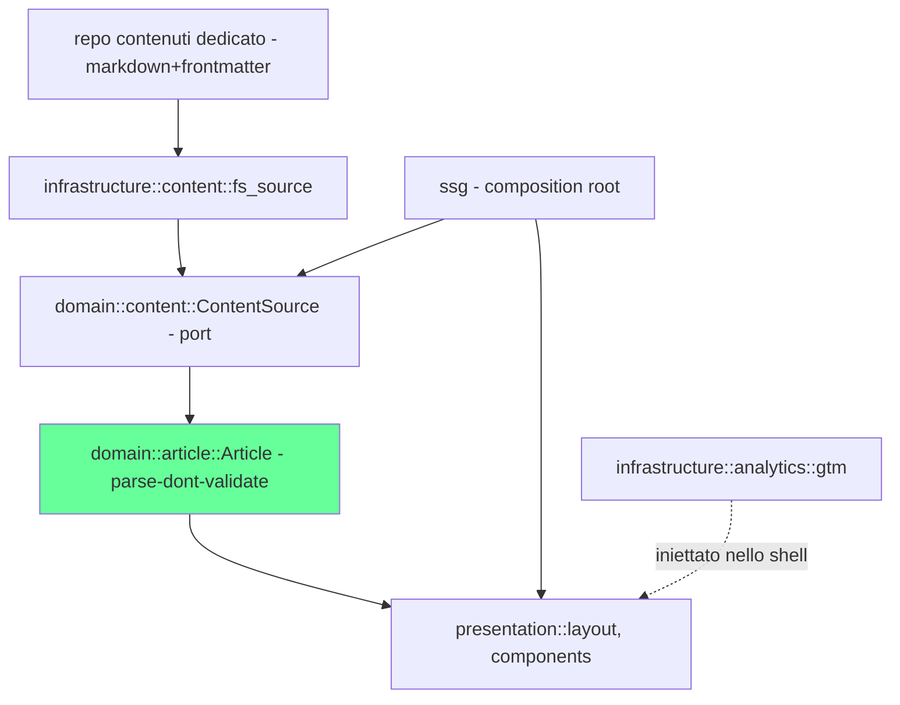

# Architecture Assessment — lucalorenzon-blog

## Session Status
| Phase | Status | Agreed |
|---|---|---|
| Scan + Stressor Pass | complete | — |
| Interview | complete | — |
| Current Architecture | ✅ agreed | 2026-08-18 |
| Recommended Direction | ✅ agreed | 2026-08-18 |
| Gap Assessment | ✅ agreed | 2026-08-18 |
| First Moves | ✅ agreed | 2026-08-18 |

## Repository Identity
Leptos/Rust, applicazione web personale (blog). Dimensione: minimale (11 file
sorgente Rust, ~400 righe totali). Scope della sessione: intero repository
(nessun monorepo, nessun sotto-servizio). Vincolo di consegna: nessuna
scadenza esterna — priorità dettata dalla necessità professionale espressa
dall'autore, non da un impegno di terzi.

## Why We're Doing This

**Burning platform (Act 1):** il repo è fermo a una versione di ~2 anni fa
(`leptos 0.6`, `wasm-bindgen =0.2.93` pinnato) e **oggi non compila più**.
Storicamente il repo è stato ricreato più volte come banco di prova
tecnologico, senza un bisogno reale dietro. Quel bisogno ora esiste: farsi
conoscere professionalmente, valorizzando 30 anni di esperienza nel
settore. Il sito deve restare vivo (non più "uno sfizio da deployare ogni
tanto"), il che cambia i requisiti non funzionali in modo sostanziale.

**Storia (Act 2):**
- Problema storico di dimensione del bundle wasm, presente anche a vuoto
  (senza funzionalità). Le islands (`DynamicHeader`, `LightDarkSwitch`)
  erano state introdotte proprio per mitigarlo, ma mai completate come
  principio organizzativo dell'intera pagina.
- Un content layer era stato tentato con `lucalorenzon-cms` (Flutter/Dart):
  esperienza negativa esplicitamente motivata — Dart trovato verboso e
  poco leggibile, costo infrastrutturale eccessivo rispetto al bisogno
  reale (un editor markdown minimale che salvava su file).
- Il test e2e (`end2end/tests/example.spec.ts`) verifica ancora il titolo
  dello scaffold originale ("Welcome to Leptos!") — confermato dall'autore:
  mai guardato, tempo dedicato minimo. Drift trascurabile, non un asset da
  preservare.
- Il README è ancora il boilerplate generico del template Leptos, mai
  riscritto per questo progetto specifico.

## Team Vision & Guardrails

**Vision (Act 3, verbatim compresso):** tra sei mesi l'autore scrive
articoli in un editor (Zed o l'app GitHub) e li pubblica pushando su un
repo dedicato. Requisiti dichiarati: impaginazione sempre coerente,
caricamento veloce (Lighthouse >90), SEO-friendly, accessibile (WCAG 2.2
AA), osservabile via Google Tag Manager, con eventuale valutazione futura
di una suite Grafana su cloud proprio (AWS/GCP). Contenuti: materiale vario
da analizzare, rielaborare, finire (fuori scope architetturale).

**Segnale di priorità:** la vision mappa su "a clean foundation before a
bigger initiative" — seam più economico e viable, non full coverage.
Priorità: passaggio SSR→SSG+islands (vincolo storico di dimensione wasm) e
introduzione di un content layer dove oggi non esiste nulla.

**Guardrail:**
- Nessun vincolo fermo sulla scelta content-as-markdown-in-git — l'autore
  ha esplicitamente lasciato il punto aperto a valutazione nello Step 5
  (non un guardrail dato per scontato), pur avendo già scartato l'opzione
  "CMS con infrastruttura dedicata da mantenere ora".
- Categoria B (ownership/coordinamento/bus factor/release autonomy):
  collassa a trivial per ragione **strutturale** — proprietario singolo, un
  solo deploy, blog personale non pensato per un secondo owner nello
  stesso senso.

## Residues (Step 2-3)

**Categoria A — confermate:**
- *External dependency* — pin `leptos 0.6` / `wasm-bindgen =0.2.93` di due
  anni fa, build oggi rotta. Confermata come burning platform tecnica
  primaria.
- *Extreme wildcard (content)* — nessun content layer dietro il nome
  "blog"; titolo/abstract/corpo sono literal in `app.rs:35-39`. Confermata,
  e in parte già risolta a livello di direzione (niente CMS runtime ora)
  ma **aperta a valutazione** sull'implementazione esatta nello Step 5.
- *Data shape* — `/api/{tail:.*}` esposto in `main.rs:32` ma nessuna server
  function definita. Superficie dormiente, non un rischio attivo oggi.
- *Trust boundary* — non applicabile: nessuna autenticazione, nessun input
  utente oltre routing statico.

**Categoria B — collassa a trivial (ragione strutturale, non temporanea):**
ownership, coordinamento, bus factor, release autonomy tutti non
applicabili — proprietario singolo, deploy singolo.

## Domain Map

Dominio core: `Article` (non ancora esistente nel codice — è il gap
principale identificato). Subdomain generico/supporting: presentazione
(layout, componenti UI), osservabilità (GTM/Grafana). Seam naturali:
confine `components/*` ↔ `layout.rs`/`app.rs` (già pulito, via `Children`);
confine sorgente-contenuti ↔ dominio (da creare, mediato da una porta
`ContentSource`).

## Current Architecture

**Drift o mismatch?** **Mismatch.** Non c'è un'intenzione originaria sana
decaduta nel tempo: il repo è stato ricreato più volte come banco di prova
tecnologico (SSR con actix-web scelto "per lo sfizio di deployarlo",
islands introdotte a metà per curiosità sul wasm, CMS Flutter abbandonato)
senza mai una necessità reale dietro. Ora che la necessità è reale, il
pattern attuale (backend SSR sempre attivo per un contenuto di fatto
statico) non va restaurato — va progettato da capo sul dominio reale.

**Struttura attuale:**
- **Entry/SSR** — `main.rs`: server actix-web sempre attivo, genera le
  route via `leptos_actix`, serve `/pkg`, `/assets`, favicon.
- **App/routing** — `app.rs`: un'unica route (`HomePage`) + `NotFound`,
  nessun routing basato su contenuto.
- **Presentazione** — `layout.rs` + `components/{logos,headers,footers,menu}`:
  shell UI pura, oggi ben isolata (props via `Children`, nessuna dipendenza
  incrociata tra le sottocartelle).
- **Dominio/contenuto** — **inesistente**: titolo, abstract, corpo
  articolo sono stringhe lorem-ipsum letterali dentro `app.rs:35-39`.
- **Client/hydrate** — `lib.rs`: entry wasm, isole parziali
  (`DynamicHeader`, `LightDarkSwitch`) già presenti ma non ancora il
  principio organizzativo dell'intera pagina.



**Violazioni chiave:** nessuna violazione di dipendenza in senso stretto —
non c'è ancora un dominio da violare. Il problema è l'assenza del content
layer, e un entrypoint (SSR/actix) disallineato dal requisito reale
("deve restare vivo" ≠ "deve essere un backend sempre attivo").

**Archeologia:** test e2e disallineato dallo scaffold originale (drift
trascurabile, mai realmente utilizzato); README non riscritto (drift
cosmetico). Nessun altro dead code rilevante — repo troppo piccolo per
averne accumulato.

## Recommended Direction

Prodotta dalla catena `software-design` (Step 5), invocata da
`architecture-compass` con contesto convergente e segnale di priorità
dell'Atto 3.

**Calibrazione catena:** `hexagonal-architecture` applicata (nasce un
dominio reale con almeno due infrastrutture intercambiabili — sorgente
contenuti, osservabilità). `parse-dont-validate` applicata (invarianti
reali sul frontmatter: data, slug, tag). `sw-practices` sempre applicata.

**Stile:** Hexagonal Architecture. Dominio (`Article`, smart constructor
parse-dont-validate sul frontmatter) al centro; porta secondaria
`ContentSource` con adapter filesystem che legge il repo contenuti
dedicato al momento della build; porta secondaria `Analytics` per GTM (e
futuro Grafana), isolata dal dominio; presentazione che consuma `Article`
tipizzato invece di literal; composition root che sostituisce l'attuale
`main.rs` con un'invocazione di build SSG di `cargo-leptos`.

**Regola di direzione delle dipendenze:** `domain` non importa mai da
`infrastructure` né da `leptos`/view code. `infrastructure` e
`presentation` dipendono verso l'interno, mai il contrario.



**Albero cartelle target (annotato):**
```
src/
  domain/
    article.rs           # Article + smart constructor: valida data, slug, tag una volta sola
    content_source.rs    # trait ContentSource - nessun I/O, nessun leptos
  infrastructure/
    fs_content_source.rs # legge il repo contenuti dedicato, parsa frontmatter, costruisce Article
    analytics.rs          # iniezione tag GTM, adapter isolato e sostituibile
  presentation/           # ex components/ + layout.rs, solo prop tipizzate
    layout.rs
    components/{logos,headers,footers,menu}/
  ssg/                    # sostituisce main.rs: composition root, guida la build cargo-leptos SSG
```

**Reversibilità:** sostituire `ContentSource` (file → CMS/API) costa un
adapter, non una riscrittura. Reintrodurre un server dietro lo stesso core
dominio/presentazione, se SSG risultasse insufficiente in futuro, è
un'aggiunta contenuta, non un redesign.

**ADR necessarie (proposte, non ancora scritte):**
1. "SSG + islands al posto di SSR" — impatta build/deploy, difficile da
   invertire a basso costo se rimandata, guidata da NFR (dimensione wasm).
2. "Content come markdown-in-git tramite porta `ContentSource`, nessun CMS
   per ora" — era esplicitamente aperta a valutazione, non un guardrail
   dato per scontato.

## Gap Assessment

**Must change:**
- `main.rs` (server actix-web SSR sempre attivo) → sostituito dal
  composition root SSG.
- `app.rs` (contenuto letterale lorem-ipsum) → guidato da `Article` reale.
- Pin dipendenze (`leptos 0.6`, `wasm-bindgen =0.2.93`) → aggiornati, build
  oggi rotta.
- Content layer inesistente → introdurre `domain::article` + porta
  `ContentSource`.

**Should change:**
- `layout.rs:10` pattern-matching posizionale su `Children` → prop
  tipizzate (il ramo `else`, "Article not correctly configured", è già
  evidenza che il pattern dà fastidio).
- Nessun adapter di osservabilità → `infrastructure::analytics::gtm`.

**Explicitly defer:**
- Valutazione CMS oltre markdown+git — resta aperta, non bloccante grazie
  alla porta `ContentSource`.
- Suite Grafana — "valuterà in futuro", nessuna azione ora.
- Rielaborazione dei contenuti stessi — fuori scope architetturale.

**Leave alone:**
- `components/{logos,headers,footers,menu}` — confine già pulito (props
  via `Children`), non va ristrutturato, solo alimentato con dati tipizzati
  invece di literal.

**Fuori scope di questo assessment (verificato via grep, non per
assunzione — vedi nota sotto):** discoverability (robots.txt, sitemap,
feed RSS/Atom), SEO on-page tattico (meta OG/Twitter, canonical, JSON-LD),
pagine identità professionale (chi sono, contatti), navigazione contenuti
oltre il singolo articolo (listing, tag, archivio), consenso/cookie prima
di GTM, versionamento per-articolo. Sono tutti assenti nel codice attuale.
`architecture-compass`/`software-design` coprono correttamente
dominio/porte/build strategy per costruzione di scope — questi temi sono
materiale per un `/epic` di content strategy/SEO/compliance separato, non
un'estensione di questo assessment.

## First Moves

**Move 1 — Aggiornamento dipendenze e ripristino build**
Perché per primo: oggi nulla compila; nessuna mossa successiva è
verificabile senza questo. Lane: `/chore` (config/dependency, nessuna
logica di dominio coinvolta). Moduli: `Cargo.toml`, `Cargo.lock`,
`rust-toolchain.toml`, eventuali adeguamenti di feature-flag in
`main.rs`/`lib.rs`. Dipende da: nessuno. Fatto quando: la build completa
senza errori sulla toolchain corrente.

**Move 2 — Content layer: porta `ContentSource` + dominio `Article`**
Perché secondo: è il cuore della vision, ma introduce comportamento e
dominio nuovi — non un refactor a comportamento preservato. Lane:
`/sw-story-split` (richiede prima un epic/UC secondo la thin-lane
routing, essendo dominio reale nuovo). Moduli: nuovo `src/domain/`,
`src/infrastructure/fs_content_source.rs`. Dipende da: Move 1. Fatto
quando: `domain/` non importa nulla da `infrastructure`/`leptos`; un
articolo di test viene letto dal repo contenuti dedicato e renderizzato
via `Article` tipizzato, non più literal in `app.rs`.

**Move 3 — SSR → SSG: sostituire `main.rs` con la composition root**
Perché terzo: generare staticamente ha senso solo una volta che esiste un
dominio contenuti da servire (Move 2). Lane: `/sw-story-split` (cambia
comportamento/deployment). Moduli: `main.rs` (ritirato), nuovo
`ssg/main.rs`, `Dockerfile` (da server always-on ad artefatto statico).
Dipende da: Move 2. Fatto quando: la build produce output statico
deployabile senza processo server always-on; dimensione wasm e Lighthouse
misurabili sul risultato.

**Nota ADR:** le due ADR proposte nella Recommended Direction vanno
scritte prima o insieme a Move 2/3 rispettivamente — non sono una move a
sé, ma il fondamento scritto delle due decisioni che quelle move eseguono.

## Progress Log

- 2026-08-18 — Sessione completa: scan, stress, intervista, current
  architecture, recommended direction (handoff a `software-design`), gap
  assessment, first moves — tutti agreed nella stessa sessione. Check
  complementare via `/btw` (fork in background) su copertura best-practice
  blog personale/professionale, esito integrato in Gap Assessment come
  "fuori scope di questo assessment".
