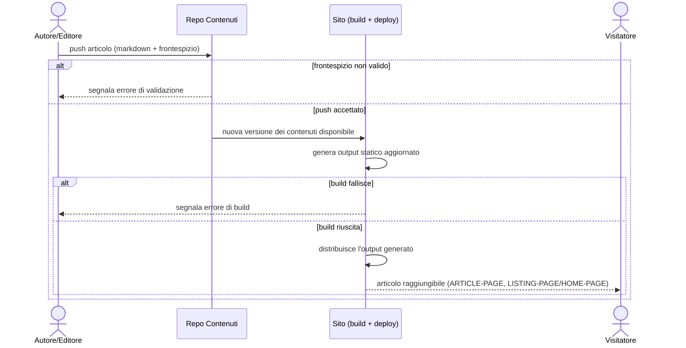

# UC-001: Autore pubblica un nuovo articolo

| Field | Value |
|---|---|
| **Epic** | EP-001 — Rilancio del blog personale come presenza professionale |
| **Goal level** | ⚡ User-Goal |
| **Scope** | Sistema di pubblicazione del blog (repo contenuti dedicato + sito statico generato) |
| **Primary actor** | Autore/Editore |
| **Preconditions** | L'autore ha accesso in scrittura al repo contenuti dedicato; il sito è già distribuito da una build precedente |
| **Success guarantee** | L'articolo è raggiungibile pubblicamente sul sito generato (ARTICLE-PAGE), con contenuto e metadati (data, slug, tag) corretti, ed elencato nella LISTING-PAGE/HOME-PAGE pertinente |
| **Trigger** | L'autore vuole pubblicare un nuovo articolo |

## Main Success Scenario

1. Autore scrive un file markdown con frontespizio (data, slug, tag, titolo, abstract, immagine di sintesi) nel repo contenuti dedicato
2. Autore fa push del file sul repo contenuti
3. Sistema rileva la nuova pubblicazione e genera il sito statico aggiornato (ARTICLE-PAGE del nuovo articolo, LISTING-PAGE e HOME-PAGE aggiornate)
4. Sistema distribuisce l'output generato
5. Sistema rende l'articolo raggiungibile dal Visitatore tramite la ARTICLE-PAGE e la LISTING-PAGE/HOME-PAGE

<!-- Verb duration check: scrive, fa push, rileva/genera, distribuisce, rende raggiungibile — tutti eventi puntuali, stessa granularità -->

## Extensions (alternative and failure paths)

**1a. Frontespizio mancante o malformato (data, slug o tag non validi):**
  1. Sistema segnala l'errore di validazione all'autore
  2. La pubblicazione non procede finché l'errore non è corretto (torna al passo 1)

**2a. Push respinto (conflitto, permessi mancanti):**
  1. Repo respinge il push
  2. Autore risolve il conflitto o ottiene i permessi necessari, poi ripete il passo 2

**3a. Slug duplicato (già usato da un articolo esistente):**
  1. Sistema segnala il conflitto di slug
  2. Autore corregge lo slug e ripete la pubblicazione

**3b. Build fallisce (errore nel processo di generazione del sito):**
  1. Sistema segnala l'errore di build
  2. L'articolo non viene pubblicato; il sito precedentemente distribuito resta invariato

**4a. Distribuzione fallisce:**
  1. Sistema mantiene attiva l'ultima versione distribuita con successo
  2. Autore viene informato dell'esito e può ripetere la pubblicazione

<!-- Each extension = one acceptance test case -->

## Open Issues

- Meccanismo di trigger della build (CI su push vs. comando manuale dell'autore) non deciso qui — demandato alla progettazione tecnica (design pipeline della story)
- Canale/formato con cui l'autore vede errori di validazione o di build (passi 1a, 3b) non specificato in questa UC

## Sequence Diagram

