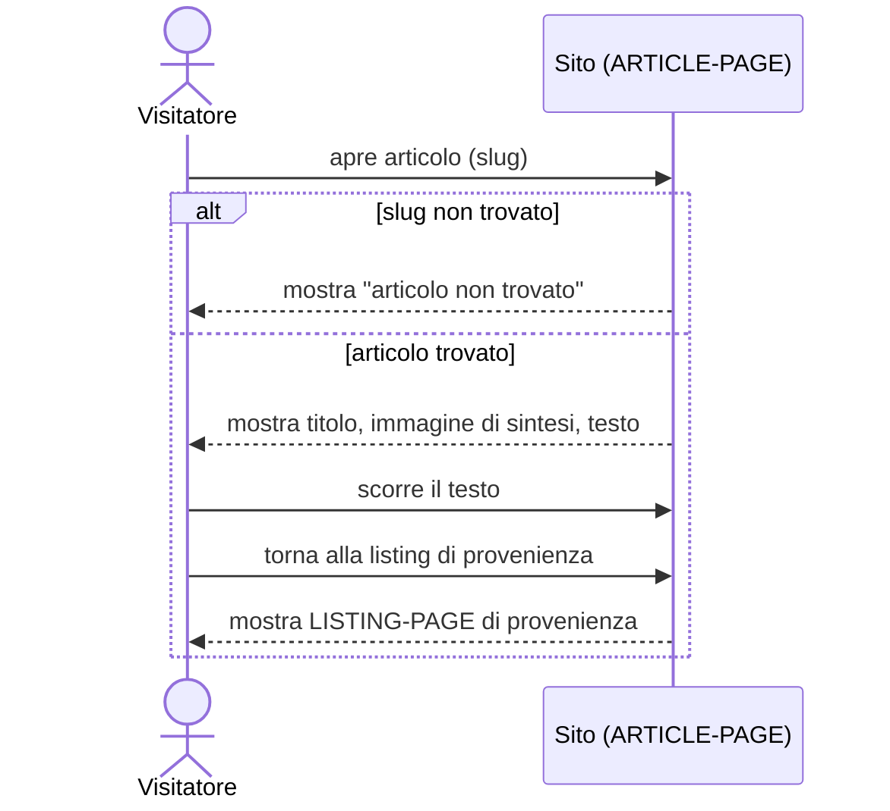

# UC-002: Visitatore legge un articolo pubblicato

| Field | Value |
|---|---|
| **Epic** | EP-001 — Rilancio del blog personale come presenza professionale |
| **Goal level** | ⚡ User-Goal |
| **Scope** | Sito blog (ARTICLE-PAGE) |
| **Primary actor** | Visitatore del sito |
| **Preconditions** | Almeno un articolo è pubblicato; il visitatore ha raggiunto l'indirizzo di un articolo (da una LISTING-PAGE, da un link esterno o diretto) |
| **Success guarantee** | Il visitatore ha visualizzato il contenuto completo dell'articolo (immagine di sintesi e testo) |
| **Trigger** | Il visitatore apre la pagina di un articolo |

## Main Success Scenario

1. Visitatore apre la ARTICLE-PAGE di un articolo pubblicato
2. Sistema mostra l'header sticky (vedi [UC-004](./UC-004-header-adattivo-scroll.md)) con il titolo dell'articolo
3. Sistema mostra l'immagine di sintesi dell'articolo
4. Sistema mostra il testo dell'articolo, scorribile
5. Visitatore scorre il testo per leggerlo
6. Visitatore torna alla LISTING-PAGE che ha invocato l'articolo

<!-- Verb duration check: apre, mostra, mostra, mostra, scorre, torna — tutti eventi puntuali, stessa granularità -->

## Extensions (alternative and failure paths)

**1a. L'articolo richiesto non esiste (slug non trovato):**
  1. Sistema mostra una pagina "articolo non trovato"
  2. Visitatore può tornare alla HOME-PAGE

**1b. Visitatore apre il menu invece di leggere subito:**
  1. Vedi [UC-005](./UC-005-visitatore-usa-menu-navigazione.md)

**6a. Visitatore è arrivato alla ARTICLE-PAGE senza passare da una LISTING-PAGE (link diretto/esterno):**
  1. Sistema offre comunque un modo per tornare a una LISTING-PAGE (HOME-PAGE), poiché la lista di origine non è nota

**6b. Visitatore naviga altrove invece di tornare alla listing (chiude il tab, segue un link nel testo, apre il menu):**
  1. Scenario termina senza un'azione di ritorno esplicita

<!-- Each extension = one acceptance test case -->

## Open Issues

- Nessuno specifico a questa UC; vedi Open Issues in [UC-004](./UC-004-header-adattivo-scroll.md) per il comportamento dell'header durante la lettura

## Sequence Diagram

