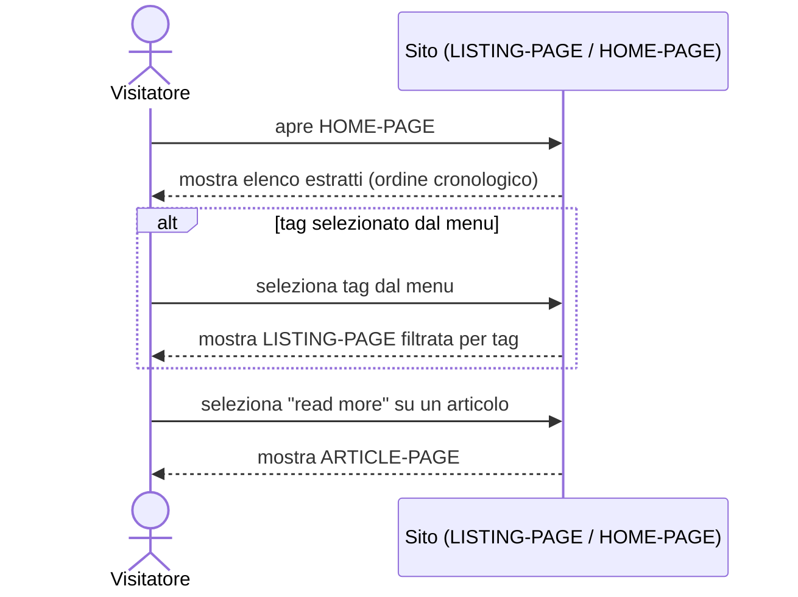

# UC-003: Visitatore sfoglia l'elenco degli articoli

| Field | Value |
|---|---|
| **Epic** | EP-001 — Rilancio del blog personale come presenza professionale |
| **Goal level** | ⚡ User-Goal |
| **Scope** | Sito blog (LISTING-PAGE / HOME-PAGE) |
| **Primary actor** | Visitatore del sito |
| **Preconditions** | Il sito è pubblicato (può avere zero o più articoli) |
| **Success guarantee** | Il visitatore ha visualizzato un elenco di estratti di articoli e, se lo desidera, ha selezionato un articolo da leggere |
| **Trigger** | Il visitatore apre la HOME-PAGE, una LISTING-PAGE filtrata per tag, o torna a una LISTING-PAGE da un articolo |

## Main Success Scenario

1. Visitatore apre la HOME-PAGE
2. Sistema mostra l'header sticky (vedi [UC-004](./UC-004-header-adattivo-scroll.md)) con "HOME PAGE" come titolo
3. Sistema mostra l'elenco degli estratti degli articoli in ordine cronologico, ciascuno con un link "read more"
4. Visitatore seleziona il link "read more" di un articolo
5. Sistema apre la ARTICLE-PAGE dell'articolo selezionato (vedi [UC-002](./UC-002-visitatore-legge-articolo.md))

<!-- Verb duration check: apre, mostra, mostra, seleziona, apre — tutti eventi puntuali, stessa granularità -->

## Extensions (alternative and failure paths)

**1a. Nessun articolo pubblicato:**
  1. Sistema mostra un elenco vuoto con messaggio "nessun articolo pubblicato"

**3a. Visitatore ha selezionato un tag dal menu (vedi [UC-005](./UC-005-visitatore-usa-menu-navigazione.md)) invece di aprire la HOME-PAGE:**
  1. Sistema mostra la LISTING-PAGE filtrata, con solo gli estratti degli articoli che hanno quel tag, in ordine cronologico
  2. Se nessun articolo ha quel tag: sistema mostra un elenco vuoto (stesso messaggio dell'estensione 1a)

**4a. L'elenco supera lo spazio di una singola schermata (molti articoli):**
  1. Sistema espone il resto dell'elenco (meccanismo esatto — paginazione, scroll progressivo — non deciso in questa UC, vedi Open Issues)

<!-- Each extension = one acceptance test case -->

## Open Issues

- Meccanismo di paginazione/scroll per elenchi lunghi (estensione 4a) non deciso in questa UC — demandato alla progettazione tecnica
- Il layout "slider orizzontale con effetto lente" (l'articolo principale che scorrendo cede il posto a un carosello di box orizzontali) resta esplicitamente fuori da questa UC: qui si documenta solo la versione a lista verticale con "read more". Se adottato, lo slider sarà una revisione futura (Next/Later) di questa stessa UC, da verificare separatamente su performance (Lighthouse >90) e accessibilità (WCAG 2.2 AA) prima dell'adozione — entrambi Acceptance Criteria di EP-001

## Sequence Diagram

