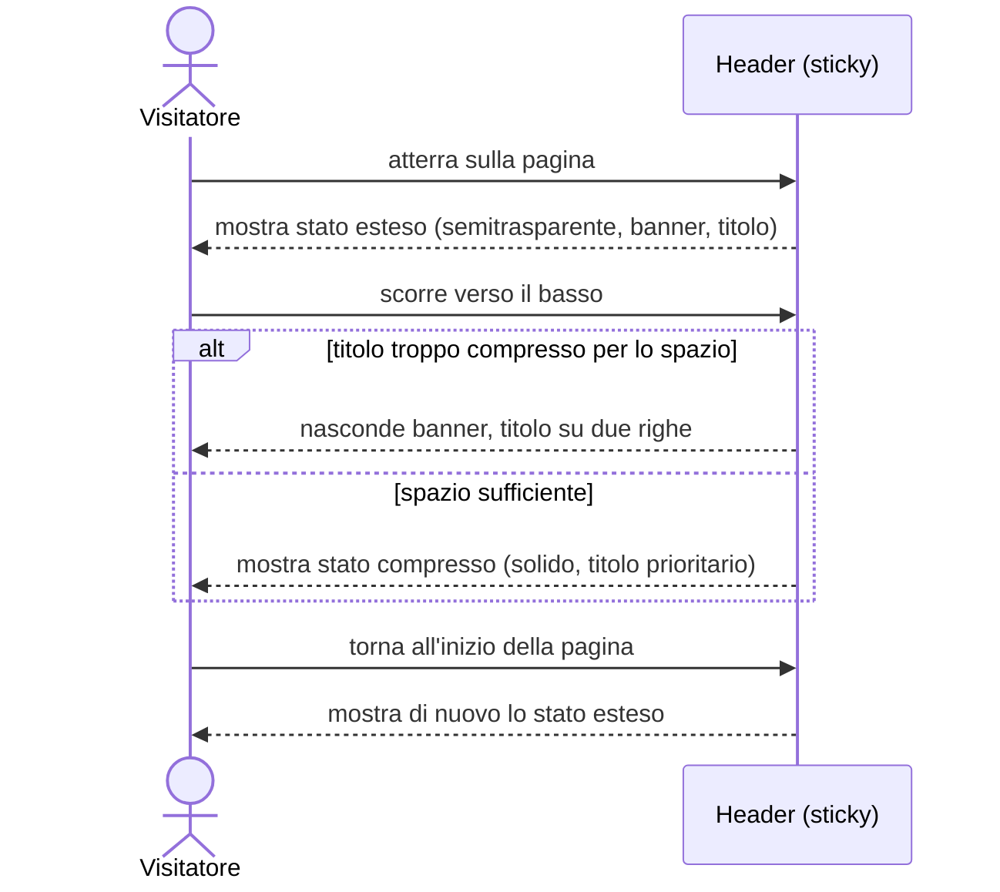

# UC-004: Header si adatta allo scroll e al contesto della pagina

| Field | Value |
|---|---|
| **Epic** | EP-001 — Rilancio del blog personale come presenza professionale |
| **Goal level** | ⬇ Subfunction (inclusa da [UC-002](./UC-002-visitatore-legge-articolo.md) e [UC-003](./UC-003-visitatore-sfoglia-elenco-articoli.md)) |
| **Scope** | Sito blog — header sticky, presente in ogni pagina |
| **Primary actor** | Visitatore del sito |
| **Preconditions** | Il visitatore ha aperto una pagina del sito (ARTICLE-PAGE o LISTING-PAGE/HOME-PAGE) |
| **Success guarantee** | L'header resta visibile e leggibile durante la lettura, mostrando sempre il contesto corrente (titolo dell'articolo o "HOME PAGE") |
| **Trigger** | Il visitatore atterra sulla pagina o scorre il contenuto |

## Main Success Scenario

1. Visitatore atterra sulla pagina
2. Sistema mostra l'header semitrasparente e di dimensione maggiore: banner ASCII-art in alto a sinistra (quando lo spazio lo consente), operazioni (ricerca, menu) in alto a destra, titolo (titolo articolo o "HOME PAGE") al centro
3. Visitatore scorre la pagina verso il basso
4. Sistema riduce l'header e lo rende solido (non più trasparente), mantenendo header e footer visibili (sticky) durante tutto lo scroll
5. Visitatore scorre verso l'alto fino a tornare all'inizio della pagina
6. Sistema riporta l'header allo stato semitrasparente e di dimensione maggiore

<!-- Verb duration check: atterra, mostra, scorre, riduce/rende, scorre, riporta — tutti eventi puntuali, stessa granularità -->

## Extensions (alternative and failure paths)

**2a. Il titolo risulta troppo compresso per lo spazio disponibile (titolo lungo o schermo stretto):**
  1. Sistema nasconde il banner ASCII-art per lasciare spazio al titolo
  2. Se ancora insufficiente, il titolo va su due righe

**4a. Footer raggiunge il fondo della pagina durante lo scroll:**
  1. Comportamento del footer sticky in questo caso non specificato in questa UC (vedi Open Issues)

<!-- Each extension = one acceptance test case -->

## Open Issues

- Design alternativo valutato ma non deciso: titolo laterale a sinistra, scritto dal basso verso l'alto, sticky — da confrontare con il comportamento qui descritto prima dell'implementazione
- Soglie esatte di breakpoint/compressione per il passaggio banner→titolo-su-due-righe (estensione 2a) non specificate, da definire in fase di design tecnico
- Comportamento del footer sticky a fine pagina (estensione 4a) non specificato

## Sequence Diagram

