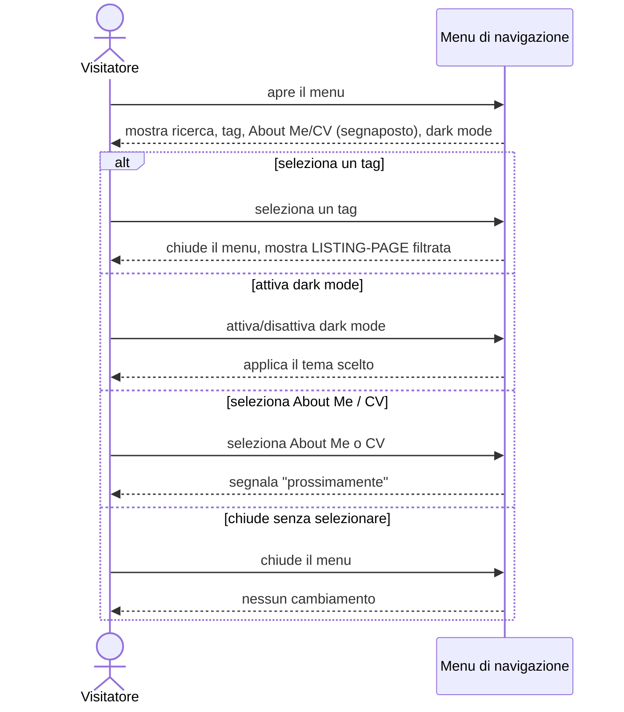

# UC-005: Visitatore usa il menu di navigazione

| Field | Value |
|---|---|
| **Epic** | EP-001 — Rilancio del blog personale come presenza professionale |
| **Goal level** | ⬇ Subfunction (inclusa da [UC-002](./UC-002-visitatore-legge-articolo.md) e [UC-003](./UC-003-visitatore-sfoglia-elenco-articoli.md)) |
| **Scope** | Sito blog — menu, presente in ogni pagina |
| **Primary actor** | Visitatore del sito |
| **Preconditions** | Il visitatore ha aperto una pagina del sito |
| **Success guarantee** | Il visitatore ha effettuato l'azione di navigazione scelta (filtro per tag o cambio tema), oppure ha chiuso il menu senza effetti |
| **Trigger** | Il visitatore apre il menu |

## Main Success Scenario

1. Visitatore apre il menu (icona nell'header)
2. Sistema mostra il menu con: campo di ricerca, elenco di 5 tag principali predefiniti, voci "About Me" e "CV" (segnaposto), interruttore dark/light mode
3. Visitatore seleziona un tag dall'elenco
4. Sistema chiude il menu e mostra la LISTING-PAGE filtrata per quel tag (vedi [UC-003](./UC-003-visitatore-sfoglia-elenco-articoli.md), estensione 3a)

<!-- Verb duration check: apre, mostra, seleziona, chiude/mostra — tutti eventi puntuali, stessa granularità -->

## Extensions (alternative and failure paths)

**1a. Visitatore chiude il menu senza selezionare nulla:**
  1. Sistema chiude il menu, nessun cambiamento di stato

**3a. Visitatore attiva/disattiva la modalità scura invece di selezionare un tag:**
  1. Sistema applica il tema scelto (dark/light) a tutta la pagina corrente

**3b. Visitatore seleziona "About Me" o "CV":**
  1. Sistema segnala che la voce non è ancora disponibile ("prossimamente"), poiché le pagine di identità professionale sono esplicitamente fuori dallo scope di EP-001

**3c. Visitatore usa il campo di ricerca:**
  1. In questo epic il campo è presente ma non esegue ricerca dal vivo: il comportamento di ricerca full-text e facet dinamici è definito nell'epic EP-004 (motore di ricerca client-side), fuori scope qui

<!-- Each extension = one acceptance test case -->

## Open Issues

- Comportamento esatto del campo di ricerca in questo epic (assente vs. presente-ma-non-funzionante, estensione 3c) da chiarire prima dell'implementazione — coordinare con EP-004
- Origine dei "5 cluster principali di tag" (selezione editoriale manuale vs. calcolo automatico dei tag più frequenti in fase di build) non decisa qui
- Se il menu resta aperto o si chiude dopo un cambio tema (estensione 3a) non specificato

## Sequence Diagram

